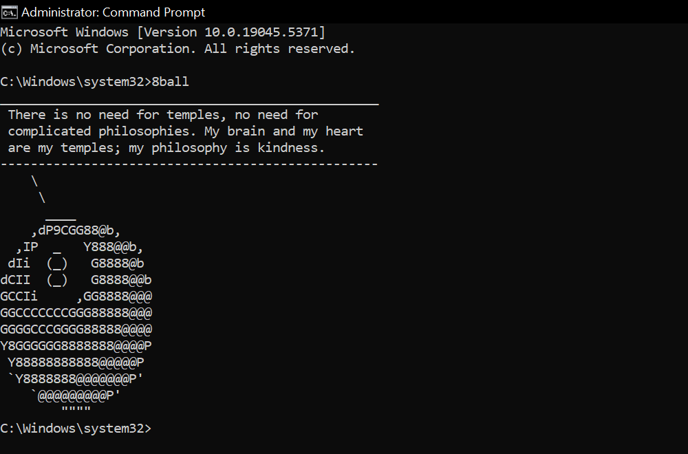

# 8 Ball Wisdom

A small windows CLI tool for nuggets of knowledge.

## Installation and Usage
Run `setup.bat` to add 8 Ball to the system environment variables.  

Enter `8ball` in command prompt to get inspired.

## Credits 
Quotes taken from: https://github.com/dwyl/quotes
